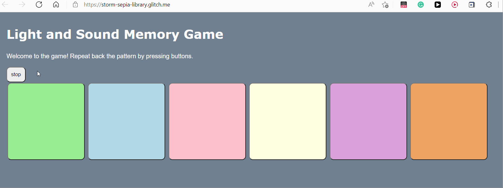

# Pre-work - *Memory Game*

**Memory Game** is a Light & Sound Memory game to apply for CodePath's SITE Program. 

Submitted by: **EdilAbe**

Time spent: **5** hours spent in total

Link to project: https://glitch.com/edit/#!/storm-sepia-library

## Required Functionality

The following **required** functionality is complete:

* [x] Game interface has a heading (h1 tag), a line of body text (p tag), and four buttons that match the demo app
* [x] "Start" button toggles between "Start" and "Stop" when clicked. 
* [x] Game buttons each light up and play a sound when clicked. 
* [x] Computer plays back sequence of clues including sound and visual cue for each button
* [x] Play progresses to the next turn (the user gets the next step in the pattern) after a correct guess. 
* [x] User wins the game after guessing a complete pattern
* [x] User loses the game after an incorrect guess

The following **optional** features are implemented:

* [ ] Any HTML page elements (including game buttons) has been styled differently than in the tutorial
* [ ] Buttons use a pitch (frequency) other than the ones in the tutorial
* [x] More than 4 functional game buttons
* [ ] Playback speeds up on each turn
* [x] Computer picks a different pattern each time the game is played
* [ ] Player only loses after 3 mistakes (instead of on the first mistake)
* [ ] Game button appearance change goes beyond color (e.g. add an image)
* [ ] Game button sound is more complex than a single tone (e.g. an audio file, a chord, a sequence of multiple tones)
* [ ] User has a limited amount of time to enter their guess on each turn

The following **additional** features are implemented:

- [ ] List anything else that you can get done to improve the app!

## Video Walkthrough (GIF)

## Reflection Questions
1. If you used any outside resources to help complete your submission (websites, books, people, etc) list them here. 
https://www.w3schools.com/colors/colors_names.asp  and Stackoverflow

2. What was a challenge you encountered in creating this submission (be specific)? How did you overcome it? (recommended 200 - 400 words) 
This project was a bit challenging for me because I’ve only had little experience working with HTML, CSS, and JavaScript. For the most part of the project I used the referenced sites and read through the dropdown tabs and made sure I understood the code with the help of W3schools and YouTube. At last, I tried writing the logic on my own but failed multiple times. Although, I couldn’t implement it on my own, I took the time to properly understand the coding and logic behind the game. Overall, it was a great learning opportunity, and I am excited to learn more.
3. What questions about web development do you have after completing your submission? (recommended 100 - 300 words) 
How to build a project that includes a multiple webpage?
How to add security layers to website?
What differences are there in developing mobile platforms and desktop platforms?
Finally, how to optimize our website? 

4. If you had a few more hours to work on this project, what would you spend them doing (for example: refactoring certain functions, adding additional features, etc). Be specific. (recommended 100 - 300 words) 
If I had more time and experience with JavaScript, I would add multiple tiers to the game, with each round allowing the player to unlock the next tier. In the "beginning" level, the player would have three attempts and six buttons with each step, though, the number of attempts will decrease. I'd refactor the code to add a timer, change the game speed, and add additional buttons to each level to make it more difficult. I'd also include a clapping sound when a player completes a stage and a fainting sound when a player fails to make the game more engaging. To spice things up, I'd change the frequency map and rearrange the game's pattern to make it sound more like real instruments.

## Interview Recording URL Link

[My 5-minute Interview Recording] https://youtu.be/cFWUbNupwTw

## License

    Copyright Edilawit Tsehay

    Licensed under the Apache License, Version 2.0 (the "License");
    you may not use this file except in compliance with the License.
    You may obtain a copy of the License at

        http://www.apache.org/licenses/LICENSE-2.0

    Unless required by applicable law or agreed to in writing, software
    distributed under the License is distributed on an "AS IS" BASIS,
    WITHOUT WARRANTIES OR CONDITIONS OF ANY KIND, either express or implied.
    See the License for the specific language governing permissions and
    limitations under the License.
